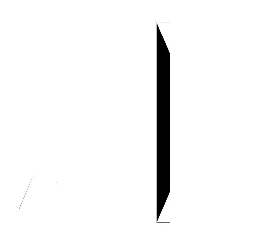

<div align="center">
  
  <p><strong>VeixEngine</strong> · Java Agent · JNI · <code>veix_mc_bridge</code> FFI</p>
</div>

<br />

# VeixEngine（Build1）说明

VeixEngine 面向 Minecraft Java 版客户端侧的开发与实验流程：通过 **Java Agent** 在 JVM 极早阶段注入，结合可选的 **原生动态库** 与 **Rust JNI 桥**，在保留贴近原版注册与类名映射的前提下，把 C/C++ 模组、物品管线与启动器串联起来。本文档说明仓库布局、构建方式、Agent 参数、FFI（对外 C ABI）以及部署与排错要点，便于新成员与集成方快速上手。

---

## 1. 仓库与目录结构

工作区根目录为 Rust workspace，主要成员包含：

- **`veixengine/crates/veix-engine`**：引擎侧 Rust 逻辑（含 Build1 相关模块）。
- **`veixengine/crates/veix-mc-launch`**：Windows 优先的 Minecraft 启动器：解析版本 JSON、拼装 classpath、附加 **`veix-agent.jar`** 并启动游戏。
- **`veixengine/crates/veix-mc-bridge`**：产出 **`veix_mc_bridge.dll`**（`cdylib`）。由 Agent 通过 `System.load` 加载后，在 `JNI_OnLoad` 中缓存 `JavaVM*`，并向原生模组导出稳定的 C 函数（物品注册桥）。
- **`veixengine/agent-java/veix`**：Java Agent 源码（`Premain-Class` / `Agent-Class` 为 `veix.VeixAgent`），打包进 **`veix-agent.jar`**（构建脚本会并入 ASM 依赖以便字节码改写）。
- **`veixengine/agent-java/native/veix_native.c`**：小型 JNI 库，Windows 下编为 **`veix_native.dll`**（由 `veix-mc-launch` 的 `build.rs` 在具备 JDK 头文件与编译器时编译）。负责物品键哈希、日志追加，以及 Windows 上通过 `LoadLibraryW` 加载测试模组并调用导出符号 **`veix_mod_plugin_boot`**。
- **`veixengine/native/veix-mod-sdk/include/veix/mod_api.h`**：面向模组侧的 **C ABI 头文件**（与 `veix_mc_bridge.dll` 导出符号对应）。
- **`tools/`**：可选便携 JDK、依赖下载脚本等（见下文环境说明）。

若使用仓库外的 **`DEVSDK`**（与本仓库并列的常见布局：`VeixEngine/DEVSDK`），其中另有 **`include/veix/mod_api.h`** 等与 DLL 一致的声明，便于无 JNI 头文件的纯 C/C++ 模组工程链接。

---

## 2. 环境与依赖

- **Rust**：工具链版本以 workspace `Cargo.toml` 中 `rust-version` 为准；建议使用稳定版 `rustc` / `cargo`。
- **JDK**：构建 **`veix-agent.jar`** 与 **`veix_native.dll`** 时需要 **`javac` / `jar`** 以及 **`include/jni.h`**。请将 **`JAVA_HOME`**（或 **`VEIX_JAVA_HOME`**）指向完整 JDK；也可使用仓库 **`tools/jdk`** 下解压的便携 JDK（与 `build.rs` 查找逻辑一致）。
- **ASM**：Agent 编译依赖 OW2 ASM；构建脚本会尝试从 `agent-java/deps/`、`OUT_DIR` 缓存或 Maven 中央仓库获取 **`asm-9.7.jar`**。若离线构建，可先运行仓库提供的依赖脚本（如 **`veixengine/tools/download-build-deps.ps1`**）预置依赖。
- **原生编译器（仅 Windows 下生成 `veix_native.dll`）**：`PATH` 中需有 **`clang`**、** MSVC `cl`** 或 **MinGW `gcc`** 之一；否则 Agent 仍可运行，但会退化为纯 Java 哈希路径，并跳过原生 DLL 复制（构建日志会给出警告）。

联网首次构建可能下载 Rust crate 与 ASM；请保证网络或预先缓存注册表镜像。

---

## 3. 构建产物与命令

在仓库根目录执行：

```bash
cargo build
```

发布构建：

```bash
cargo build --release
```

常见产物位置（以默认 `target` 为准）：

| 产物 | 说明 |
|------|------|
| **`target/<profile>/veix-agent.jar`** | 由 `veix-mc-launch` 的构建脚本生成并复制到 profile 目录；内含 `veix` 包与 ASM。 |
| **`target/<profile>/veix_native.dll`** | 若 JNI 编译成功，与上者一同复制。 |
| **`target/<profile>/veix_mc_bridge.dll`** | `veix-mc-bridge` crate 的 `cdylib` 输出。 |
| **`target/<profile>/veix-mc-launch.exe`** | 启动器可执行文件（Windows）。 |

单独构建桥梁库：

```bash
cargo build -p veix-mc-bridge
```

单独构建启动器（会触发 Agent JAR 与可选 `veix_native` 的生成逻辑）：

```bash
cargo build -p veix-mc-launch
```

若 **`javac` 缺失**，构建脚本会写入占位说明文件 **`VEIX_AGENT_BUILD_SKIPPED.txt`**，此时需补齐 JDK 后重新构建。

---

## 4. Java Agent：职责与启动参数

Agent 入口类为 **`veix.VeixAgent`**，支持 **`premain`** / **`agentmain`**。启动器会通过 JVM 参数附加：

```text
-javaagent:<路径>/veix-agent.jar=<参数>
```

参数为逗号分隔的 **`键=值`**，常用项如下：

| 参数 | 含义 |
|------|------|
| **`gameDir`** | 游戏实例目录（日志、物品列表、`veix/` 子目录等均相对此路径）。 |
| **`asmMainHook=1`** | 使用 ASM 改写 **`net.minecraft.client.main.Main#main`**，便于在入口附近挂钩（具体行为见源码与日志）。 |
| **`traceClasses=1`** | 类加载追踪（只记录，不改写字节码）；可配合 **`maxTrace`**、**`classPrefix`**。 |
| **`veixItems=1`** | 启用物品管线：读取 **`gameDir/veix/veix_items.txt`**，并可选用 **`veix_native.dll`** 做键哈希与原生日志，同时应部署 **`veix_mc_bridge.dll`** 以便从原生侧经 JNI 调 **`VeixRegistryBridge`** 注册物品。 |
| **`veixTestMod=1`** | 从 **`gameDir/veix/plugins/veix_test_mod.dll`** 加载测试模组并调用 **`veix_mod_plugin_boot`**；需先加载 **`veix_mc_bridge.dll`**（Agent 内已由 **`VeixMcBridgeLoader`** 在加载插件前确保）。 |

日志默认写入 **`gameDir/logs/veix.log`**；部分模块还会写入 **`veix/`** 下的专项日志文件（例如原生物品日志路径见 `VeixNativeItems` 注释）。

---

## 5. FFI 与 Native Bridge 分层说明

本项目的「桥」分为两层，职责清晰，避免混用：

### 5.1 `veix_native.dll`（C / JNI）

- 面向 **Java**：类 **`VeixNativeItems`**、**`VeixPluginLoader`** 声明 `native` 方法，由 `veix_native.c` 实现。
- 能力概览：与 Java 一致的 **FNV-1a 32 位** 物品短键、向 **`gameDir/veix/veix_native_items.log`** 追加一行、（Windows）**`LoadLibraryW`** 加载指定路径 DLL 并 **`GetProcAddress("veix_mod_plugin_boot")`** 执行。
- 非 Windows 上插件启动相关 JNI 可能返回固定错误码（见源码），以提示当前平台未实现该路径。

### 5.2 `veix_mc_bridge.dll`（Rust / JNI + C ABI）

- 由 Java **`VeixMcBridgeLoader`** 使用 **`System.load`** 加载，触发 **`JNI_OnLoad`**，在进程内缓存 **`JavaVM*`**。
- 若 DLL 并非经 JVM 加载（例如宿主手动 `LoadLibrary`），可调用 **`veix_mc_set_java_vm`**，传入 **`JNI_GetCreatedJavaVMs`** 得到的指针。
- **C ABI**（声明见 **`mod_api.h`**）包括但不限于：
  - **`veix_mc_register_item(namespace, path)`**：两段式 UTF-8 字符串，等价 Java 侧 **`namespace:path`**。
  - **`veix_mc_register_item_by_key(namespaced_id)`**：单字符串完整 ID，与 **`VeixRegistryBridge.registerItemByKey`** 一致。
  - **`veix_mc_java_vm_ready()`**：返回是否已成功缓存虚拟机（便于模组侧在注册前探测）。
- Java 侧 **`VeixRegistryBridge`** 使用反射调用 Mojang 映射类名（如 **`ResourceLocation.parse`**、**`BuiltInRegistries.ITEM`** 等）。**混淆或未映射客户端**需自行替换类名或接入映射表；注册表若已冻结会返回约定错误码（详见 Java 注释）。

部署时请保证 **`veix_mc_bridge.dll`** 与 **`veix-agent.jar`** 同目录，或位于 **`gameDir/veix/`**，或通过系统属性 **`veix.bridge.lib`** 指定完整路径。同理，**`veix_native.dll`** 可通过 **`veix.native.lib`** 或默认搜索顺序解析。

---

## 6. 启动器 `veix-mc-launch` 要点

启动器负责解析 **`--game-dir`**、**`--version`**（对应 **`{game_dir}/{version}.json`**）、Java 可执行文件、libraries/assets 根目录，并组装与 HMCL 类似的启动命令。默认将 **`veix-agent.jar`** 解析为与 **`veix-mc-launch.exe` 同目录；也可用 **`--veix-agent-jar`** 或环境变量覆盖。

常用 CLI 开关包括：**`--trace-classes`**、**`--veix-items`**、**`--veix-test-mod`**、**`--no-asm-main-hook`**、**`--dry-run`**（仅打印命令）等。首次使用请确认版本 JSON、依赖库目录与资产目录存在，否则启动器会报错退出并提示检查路径。

---

## 7. DEVSDK 与测试模组流程简述

使用 **`DEVSDK`** 编译 **`veix_test_mod.dll`** 时，需链接或运行时依赖 **`veix_mc_bridge.dll`** 提供的符号；将测试模组放到 **`gameDir/veix/plugins/`**，并在 Agent 参数中开启 **`veixTestMod=1`**。游戏进程启动顺序应保证：**JVM 已加载 Agent → 加载 `veix_mc_bridge.dll` → 再加载模组 DLL 并执行 `veix_mod_plugin_boot`**。若 **`veix_mc_java_vm_ready()`** 为 0，说明桥未就绪，注册调用会失败。

---

## 8. 常见问题（排错）

- **`未找到 veix_mc_bridge.dll`**：检查是否与 JAR 同目录或 **`gameDir/veix/`**，或设置 **`veix.bridge.lib`**。
- **物品注册返回负错误码**：多为类名不符、注册表已冻结或调用时机过晚；尝试更早的 Agent 钩子或对齐映射。
- **无 `veix_native.dll`**：检查 **`JAVA_HOME`**、编译器是否在 **`PATH`**，并查看构建警告。
- **正版 / 离线令牌**：启动器当前文档化离线占位与会话参数；在线模式需自行提供 **`--access-token`**（详见 **`veix-mc-launch`** 帮助）。

---

## 9. 许可证

Workspace 元数据声明为 **GPLV3**（以各 crate `Cargo.toml` 与 SPDX 为准）。第三方组件（如 ASM、Minecraft 本体）遵循其各自许可证；分发整合包时请一并核对。

---

## 10. 版本、映射与兼容性约定

Minecraft 客户端随版本迭代会更改类名、包路径与注册时机。本仓库 Java 侧默认采用 **Mojang 官方映射**（如 **`net.minecraft.resources.ResourceLocation`**）书写反射调用，因此在 **未混淆的开发环境**（常见映射名与源码一致）下最易一次性跑通。若目标发行包为 **Proguard / 其他混淆**，必须在 **`VeixRegistryBridge`** 一层替换为正确的运行时类名，或改为读取外部映射表再反射；否则会得到 **`ClassNotFoundException`** 一类错误，对应桥接返回码中以 **`负号`** 表示的失败分支。

物品注册依赖 **`BuiltInRegistries.ITEM`** 等注册表 API。若在游戏生命周期中注册表已经 **冻结（frozen）**，即使反射路径正确也会注册失败，日志中可能出现 “frozen” 相关字样。此类问题通常不是 FFI 本身损坏，而是 **调用时机过晚**；缓解思路包括：提前 Agent 介入点、在 **`Main#main`** 改写路径上更早触发、或与模组加载器协同保证注册发生在冻结之前。团队内建议把 **成功注册返回 0**、**各类负返回码** 与 **日志行** 一并记录在集成测试清单中，便于回归。

Rust **`jni`** 与 **`jni-sys`** 的版本由 **`veix-mc-bridge`** 的 **`Cargo.toml`** 锁定；升级大版本时请完整运行 **`cargo build`** 与一次 **`veixTestMod`** 烟测，确认 **`JNI_OnLoad` / `JNI_OnUnload`** 与线程附着行为无回归。Windows 上 **`cdylib`** 导出符号依赖 **`#[no_mangle]`** 与链接器默认规则；若未来引入更多导出函数，请同步更新 **`mod_api.h`**、**DEVSDK** 头文件与本文档 **§5** 的符号表，避免文档与二进制不一致。

---

## 11. 小结

VeixEngine Build1 将 **Java Agent**、**可选 JNI 辅助库** 与 **Rust JNI 桥 DLL** 组合成一条可落地的客户端扩展链路：启动器负责注入与参数传递，Java 侧维持与原版一致的反射注册路径，原生侧通过稳定 **C ABI** 注册物品并可通过 **`veix_mc_java_vm_ready`** 自检。按本文档放置产物、配置 JDK 与 Agent 开关后，即可在本地迭代 **`veix_items.txt`**、DEVSDK 模组与 ASM 钩子；若需扩展更多 FFI 条目或跨平台原生加载，建议在 **`veix-mc-bridge`** 与 **`mod_api.h`** 同步演进并保持错误码与 Java 侧一致。

长期维护时，请把 **构建警告**（例如增量编译缓存硬链接失败）与 **Agent 日志** 一并纳入 CI 或本地脚本收集，以便在 JDK 升级、路径变化或杀毒软件锁定 DLL 时快速定位。祝开发与联调顺利。
